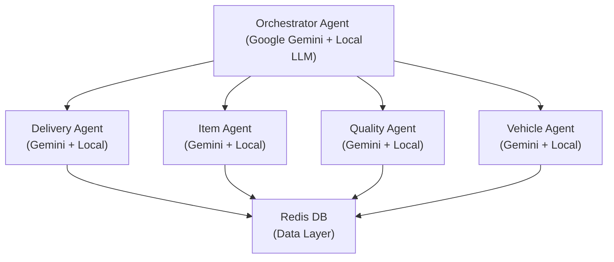

**Google Gemini 지원 다중 에이전트 물류 관리 시스템**

Attager는 Google Gemini API를 활용한 지능형 다중 에이전트 물류 관리 시스템입니다. 배송, 상품, 품질, 차량 관리를 각각의 전문 에이전트가 담당하며, 중앙 오케스트레이터가 이들을 조정합니다.

## 🚀 주요 특징

- **🤖 Google Gemini 통합**: 모든 에이전트에서 Gemini 1.5 Pro 모델 지원
- **🔄 Fallback 시스템**: Gemini 실패 시 자동으로 로컬 LLM(Ollama)으로 전환
- **🐳 Docker 지원**: 완전한 컨테이너화된 배포
- **🎯 전문화된 에이전트**: 각 도메인별 최적화된 AI 에이전트
- **📊 실시간 데이터**: Redis 기반 실시간 데이터 처리
- **🔗 A2A 통신**: Agent-to-Agent 프로토콜을 통한 에이전트 간 통신

## 🆕 최근 변경 사항

- 레거시 `Orchestrator/` 패키지를 정리하고 `Orchestrator_new`만 유지했습니다. 기본 바인딩 호스트가 `127.0.0.1` → `0.0.0.0`으로 변경되어 다른 호스트에서도 접속할 수 있습니다.
- 모든 에이전트의 `__main__.py`가 상대 임포트를 사용하도록 수정되어 반드시 **프로젝트 루트에서** `python -m agents.<name>` 형태로 실행해야 합니다.
- 신규 `run_all.sh` 스크립트가 추가되어 오케스트레이터/에이전트 일괄 실행과 종료가 가능하며, 백그라운드 구동 시 로그(`logs/`)와 PID 파일(`.agent_pids`)을 자동 관리합니다.
- 오케스트레이터는 이제 ADK Registry(`http://localhost:8000`)에서 에이전트 카드를 자동으로 불러옵니다. `agent_cards/` 폴더에 `Bridge_Agent` 카드가 추가되었고, 배송 에이전트 카드의 URL 예시가 사내망(`192.168.10.10`) 기준으로 업데이트되었습니다.
- 각 에이전트 모듈은 더 이상 ADK Registry에 자동 등록하지 않습니다. 필요 시 `agent_cards/*.json`을 최신 환경에 맞게 수정하거나 별도 등록 파이프라인을 사용하세요.

## 🏗️ 시스템 아키텍처




## 🎯 에이전트 구성

### 1. **Orchestrator Agent** (포트: 10000)
- **역할**: 사용자 요청 분석 및 적절한 에이전트로 라우팅
- **기능**: 
  - 자연어 쿼리 이해
  - 에이전트 선택 및 작업 위임
  - 응답 집계 및 사용자 피드백

### 2. **Delivery Agent** (포트: 10001)
- **역할**: 배송 관리 및 추적
- **기능**:
  - 배송 데이터 조회 (`get_delivery_data`)
  - 전체 배송 현황 조회 (`get_all_deliveries`)
  - 완료된 배송 수 조회 (`get_completed_deliveries`)

### 3. **Item Agent** (포트: 10002)
- **역할**: 상품 정보 및 재고 관리
- **기능**:
  - 상품 상세 정보 조회 (`get_item_details`)
  - 재고 추적 (`track_item_inventory`)
  - 상품 가용성 확인

### 4. **Quality Agent** (포트: 10003)
- **역할**: 품질 관리 및 반품/리콜 처리
- **기능**:
  - 반품 품질 검사 항목 조회 (`get_items_for_return_qc`)
  - 반품 상품 처분 결정 (`get_return_item_disposition`)
  - 리콜 대상 상품 관리 (`get_recall_items_list`)

### 5. **Vehicle Agent** (포트: 10004)
- **역할**: 차량 관리 및 배차 최적화
- **기능**:
  - 차량 가용성 조회 (`get_fleet_availability`)
  - 차량 상태 확인 (`get_vehicle_status`)
  - 최적 차량 추천 (`recommend_optimal_vehicles`)

### 6. **Bridge Agent** (에이전트 카드, 포트: 10007)
- **역할**: 고객팀 ↔ 물류팀 간 브릿지 라우팅
- **특징**:
  - `agent_cards/bridge_agent.json`으로 Registry에 등록
  - 교차 팀 질문을 분석해 적절한 도메인 에이전트에게 질의
  - 기본 URL은 예시로 `http://192.168.10.1:10007`로 설정되어 있으며, 실제 배포 환경에 맞게 수정 필요

## ⚙️ 설정 및 설치

### 1. 환경 설정

프로젝트 루트에 `.env` 파일을 생성하고 Google Gemini API 키를 설정하세요:

```bash
# Attager/.env
GOOGLE_API_KEY=your_google_api_key_here
GOOGLE_GENAI_USE_VERTEXAI=FALSE
USE_GEMINI=true
FALLBACK_TO_LOCAL=false  # 필요 시 true로 변경해 로컬 LLM fallback 활성화
OLLAMA_HOST=host.docker.internal
```

> 📝 **API 키 발급**: [Google AI Studio](https://makersuite.google.com/app/apikey)에서 무료 API 키를 발급받을 수 있습니다.

### 2. Docker Compose로 실행 (권장)

```bash
# 프로젝트 클론
git clone <repository-url>
cd AttagerMain/Attager

# .env 파일 설정 (위 내용 참고)
nano .env

# 전체 시스템 실행
docker compose up --build
```

### 3. 개별 에이전트 실행

```bash
# 의존성 설치
pip install -r requirements.txt

# Redis 실행 (Docker)
docker run -d --name logistics-redis -p 6379:6379 redis:7-alpine

# Orchestrator 실행 (프로젝트 루트에서)
python -m Orchestrator_new

# 개별 에이전트 실행 (프로젝트 루트에서)
python -m agents.delivery_agent
python -m agents.item_agent
python -m agents.vehicle_agent
python -m agents.qulity_agent
```

> ℹ️ 상대 임포트가 적용되어 있으므로 반드시 프로젝트 루트에서 실행하거나, 패키지를 설치한 가상환경에서 `python -m ...` 형태로 실행하세요.

### 3-1. run_all.sh로 일괄 실행

```bash
# 권장: 가상환경 활성화 후 실행
bash ./run_all.sh start               # 자동 판단: GUI면 새 터미널, 없으면 tmux, 둘 다 없으면 백그라운드

# 모드 지정
bash ./run_all.sh --mode=term start   # 새 터미널 창으로 각각 실행 (gnome-terminal/konsole/xterm 필요)
bash ./run_all.sh --mode=tmux start   # tmux 세션(agents)으로 실행 → 접속: tmux attach -t agents
bash ./run_all.sh --mode=bg start     # 백그라운드 실행 (logs/ 에 로그, .agent_pids에 PID 기록)

# 오케스트레이터 제외
bash ./run_all.sh --no-orchestrator start

# 중지
bash ./run_all.sh stop

# sudo가 꼭 필요하면 파이썬 경로를 명시해 실행 (가상환경 등)
sudo PYTHON="$(which python)" bash ./run_all.sh --mode=bg start
```

### 4. Google ADK 웹 인터페이스로 테스트 (개발용)

Google ADK의 웹 인터페이스를 사용하여 에이전트를 쉽게 테스트할 수 있습니다:

```bash
# Redis 실행 (필수)
docker run -d --name logistics-redis -p 6379:6379 redis:7-alpine

# .env 파일 설정 후 ADK 웹 인터페이스 실행
# 8000 포트는 이미 Registry 서버가 사용 중이므로, adk web --port 8001 같은 다른 포트를 지정하는 것을 권장합니다.
adk web --port 8001

# 또는 특정 에이전트만 테스트
cd agents/delivery_agent
adk web
```

웹 인터페이스 접속:
- **개발 UI**: http://localhost:8001/dev-ui
- **기본 채팅**: http://localhost:8001

#### ADK 웹 인터페이스 사용법

1. **브라우저에서 접속**: http://localhost:8001
2. **에이전트와 대화**: 
   ```
   사용자: "ORD1001 배송 상태 알려줘"
   에이전트: Redis에서 배송 데이터를 조회하여 응답
   ```
3. **개발 도구 사용**: http://localhost:8001/dev-ui에서 더 자세한 디버깅 정보 확인

#### 테스트 예시 쿼리
```
배송 관련:
- "ORD1001 주문 상태 알려줘"
- "모든 배송 데이터 보여줘"
- "완료된 배송 수는?"

상품 관련:
- "ITEM001 상품 정보 알려줘"
- "ITEM001 재고 수량은?"

품질 관리:
- "품질 검사 필요한 반품 상품 알려줘"
- "ITEM002 반품 처분 결과는?"

차량 관리:
- "전체 차량 가용 현황 알려줘"
- "정비 중인 차량은?"
```

## 🌐 API 엔드포인트

### 서비스 URL
- **Orchestrator**: http://localhost:10000
- **Delivery Agent**: http://localhost:10001
- **Item Agent**: http://localhost:10002
- **Quality Agent**: http://localhost:10003
- **Vehicle Agent**: http://localhost:10004
- **Bridge Agent**: http://192.168.10.1:10007 *(예시 값, 환경에 맞게 조정)*
- **Registry server**: http://localhost:8000
- **Registry Frontend**: http://localhost:3000
- **Redis**: localhost:6379

### 사용 예시

#### 1. 배송 조회
```bash
curl -X POST http://localhost:10000/chat \
  -H "Content-Type: application/json" \
  -d '{"message": "ORD1001 배송 상태 알려줘"}'
```

#### 2. 재고 확인
```bash
curl -X POST http://localhost:10000/chat \
  -H "Content-Type: application/json" \
  -d '{"message": "ITEM001 재고 수량 확인해줘"}'
```

#### 3. 차량 가용성 조회
```bash
curl -X POST http://localhost:10000/chat \
  -H "Content-Type: application/json" \
  -d '{"message": "전체 차량 가용 현황 알려줘"}'
```

## 🤖 AI 모델 구성

### Google Gemini (Primary)
- **모델**: Gemini 1.5 Pro Latest
- **용도**: 자연어 이해, 추론, 의사결정
- **장점**: 높은 정확도, 최신 정보 활용

### Ollama (Fallback)
- **모델**: gpt-oss:20b
- **용도**: Gemini 실패 시 백업
- **장점**: 로컬 실행, 개인정보 보호

### Fallback 로직
```
1. Gemini API 시도
   ↓ (실패시)
2. 로컬 Ollama 모델 사용
   ↓ (실패시)
3. 에러 메시지 반환
```

## 📊 데이터 구조

### Redis 키 패턴
```
delivery:order:{order_id}        # 배송 정보
item:details:{item_id}           # 상품 상세 정보
item:inventory:{item_id}         # 재고 정보
quality:return_qc:{item_id}      # 반품 품질 검사
vehicle:id:{vehicle_id}          # 차량 정보
vehicle:fleet:availability       # 차량 가용성
```

### 샘플 데이터
시스템은 시작 시 `agentDB/all_data_commands.txt`의 샘플 데이터를 Redis에 로드합니다.

## 🛠️ 개발 가이드

### 에이전트 추가하기

1. **에이전트 폴더 생성**
```bash
mkdir agents/new_agent
cd agents/new_agent
```

2. **기본 파일 구성**
```
agents/new_agent/
├── __main__.py          # 에이전트 진입점
├── agent.py             # 핵심 로직
├── agent_executor.py    # 실행기
├── Dockerfile           # Docker 설정
└── tools/               # 도구 함수들
    └── redis_tools.py
```

3. **Docker Compose에 추가**
```yaml
new-agent:
  build:
    context: .
    dockerfile: agents/new_agent/Dockerfile
  ports:
    - "10005:10005"
  environment:
    - GOOGLE_API_KEY=${GOOGLE_API_KEY}
    # ... 기타 환경변수
```

### 도구 함수 작성
```python
# agents/new_agent/tools/redis_tools.py
import redis
import json
import os

redis_client = redis.Redis(
    host=os.getenv("REDIS_HOST", "localhost"),
    port=int(os.getenv("REDIS_PORT", "6379")),
    db=0,
    decode_responses=True
)

def your_custom_function(param: str) -> dict:
    """도구 함수 예시"""
    # Redis 조회 로직
    data = redis_client.get(f"key:{param}")
    return {"status": "success", "data": data}
```

## 🚨 문제 해결

### 일반적인 문제들

#### 1. Gemini API 오류
```bash
# API 키 확인
echo $GOOGLE_API_KEY

# 할당량 확인 (Google AI Studio 콘솔)
```

#### 2. Redis 연결 오류
```bash
# Redis 상태 확인
docker ps | grep redis

# Redis 연결 테스트
redis-cli ping
```
#### 3. Docker 빌드 오류
```bash
# 캐시 클리어 후 재빌드
docker compose down
docker system prune -f
docker compose up --build
```

#### 4. 포트 충돌
```bash
# 포트 사용 확인
netstat -tulpn | grep :10000

# 프로세스 종료
kill -9 <PID>
```

### 로그 확인
```bash
# 특정 컨테이너 로그
docker logs orchestrator-agent

# 전체 로그 실시간 확인
docker compose logs -f
```

## 📈 성능 최적화

### Redis 최적화
- 적절한 메모리 할당
- 데이터 만료 시간 설정
- 인덱싱 전략

### 에이전트 최적화
- 응답 캐싱
- 병렬 처리
- 연결 풀링

## 🔒 보안 고려사항

- API 키 환경변수 관리
- Redis 접근 제어
- 네트워크 분리 (Docker networks)
- 로깅 데이터 마스킹

## 📚 참고 자료

- [Google ADK 문서](https://google.github.io/adk-docs/)
- [Google AI Studio](https://makersuite.google.com/)
- [Ollama 문서](https://ollama.ai/docs)
- [Redis 문서](https://redis.io/docs/)
- [Docker Compose 가이드](https://docs.docker.com/compose/)

## 🤝 기여하기

1. Fork the repository
2. Create your feature branch (`git checkout -b feature/AmazingFeature`)
3. Commit your changes (`git commit -m 'Add some AmazingFeature'`)
4. Push to the branch (`git push origin feature/AmazingFeature`)
5. Open a Pull Request

## 📄 라이센스

이 프로젝트는 MIT 라이센스 하에 배포됩니다. 자세한 내용은 `LICENSE` 파일을 참조하세요.

## 📞 지원

문제가 있거나 질문이 있으시면 Issue를 생성해 주세요.

---

