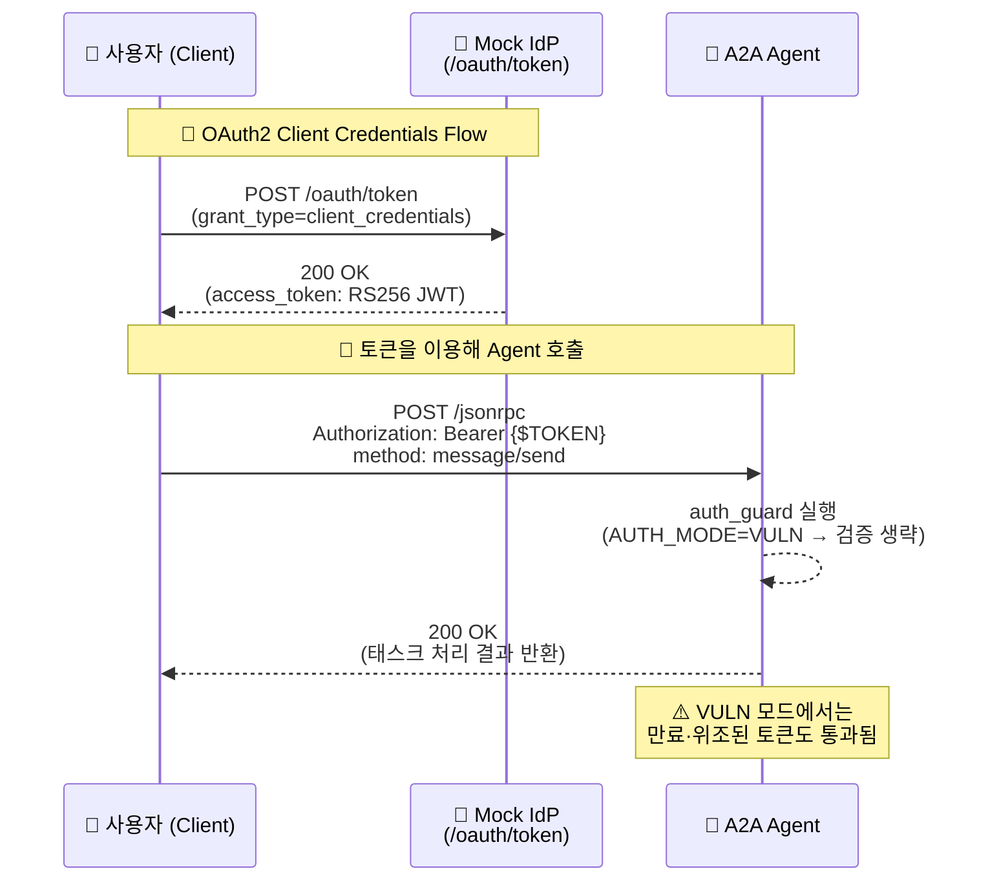

## VULN


## SECURE
```mermaid
sequenceDiagram
    %% 참가자 정의
    participant C as 👤 사용자 (Client)
    participant I as 🪪 Mock IdP<br/>(/oauth/token)
    participant A as 🤖 A2A Agent

    %% 단계 1: 토큰 발급
    Note over C,I: 🔐 OAuth2 Client Credentials Flow
    C->>I: POST /oauth/token<br/>(grant_type=client_credentials)
    I-->>C: 200 OK<br/>(access_token: RS256 JWT)

    %% 단계 2: 에이전트 호출
    Note over C,A: 🔄 발급받은 토큰으로 Agent 호출
    C->>A: POST /jsonrpc<br/>Authorization: Bearer {$TOKEN}<br/>method: message/send
    A-->>A: auth_guard 실행<br/>(AUTH_MODE=SECURE)<br/>→ JWKS fetch<br/>→ RS256 서명·iss·aud·exp 검증

    %% 조건 분기
    alt ✅ 검증 성공
        A-->>C: 200 OK<br/>(태스크 처리 응답)
    else ❌ 검증 실패
        A-->>C: 401 Unauthorized<br/>(verification failed)
    end

    %% 추가 설명
    Note over A: 🔎 SECURE 모드에서는<br/>JWT의 모든 클레임과 서명을<br/>정상적으로 검증함
